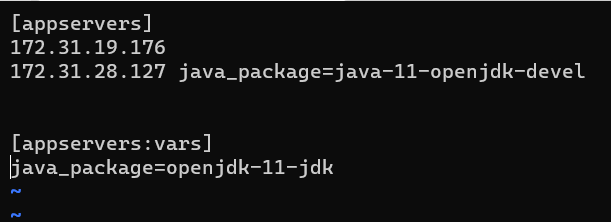

# Install java

*  create ec2 instances 
*  install ansible in one instance that is ansible control node and other instances are nodes
*  install ansible in control node [refer here](https://linuxhint.com/install-configure-ansible-ubuntu/)
*  create the user with same name then password authentication in both control node and nodes 
*  add the user in sudoers file 
*  switch to user then generate the key and copy the key into node 
*  ping ansible 
*  write a playbook [refer here]()
  
   
* apply playbook in ansible 
  